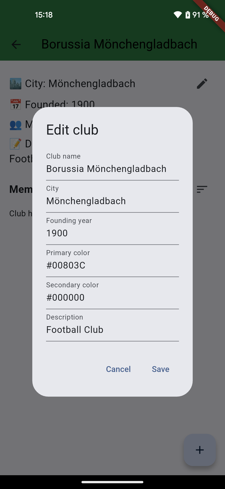

# Club Manager App  

## 📌 Overview  
The **Club Manager App** helps users efficiently manage one or multiple clubs. It provides an intuitive interface to keep track of club details, members, and organizational structures.  

    
        

## 🚀 Features  

### 🔹 Club Management  
- Create and personalize multiple clubs with essential details (name, city, founding year, description).  
- Customize each club's page with unique club colors.  
- Edit or update club information at any time.  
- Delete a club along with all its associated members in one click.

### 🔹 Member Management  
- Add unlimited members to a club and store relevant details (name, birthdate).  
- Quickly edit, update, or remove members.  
- Efficiently sort members based on different criteria.

### 🔹 User-Friendly & Efficient  
- Simple and intuitive UI for easy navigation.  
- Quick actions to manage clubs and members with minimal effort.  
- Designed for club managers who need a clear and structured overview.

    
    
    
    
    

